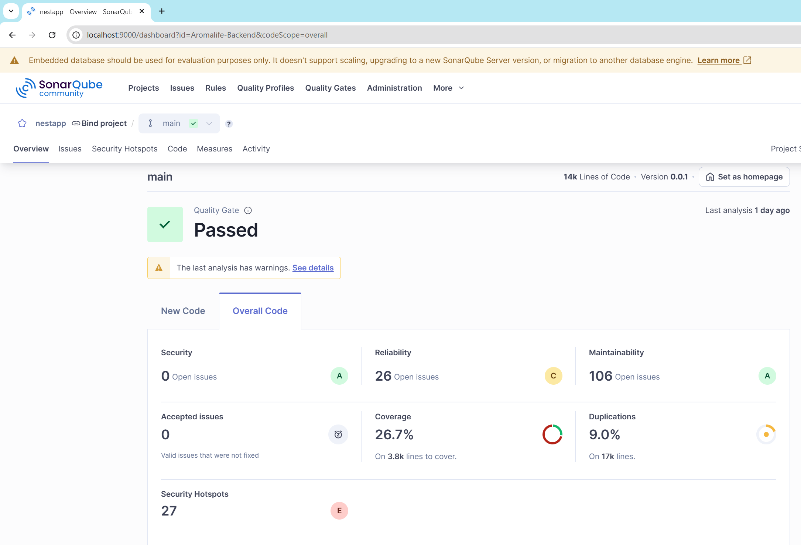
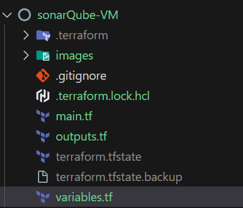
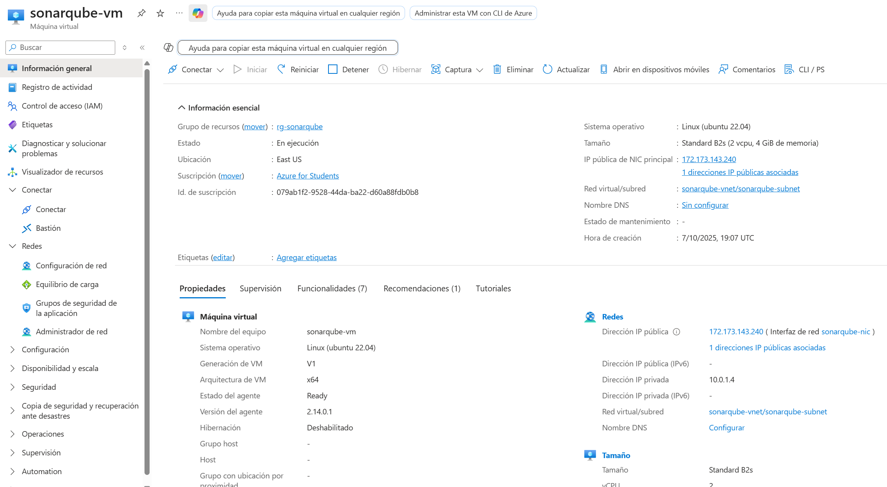
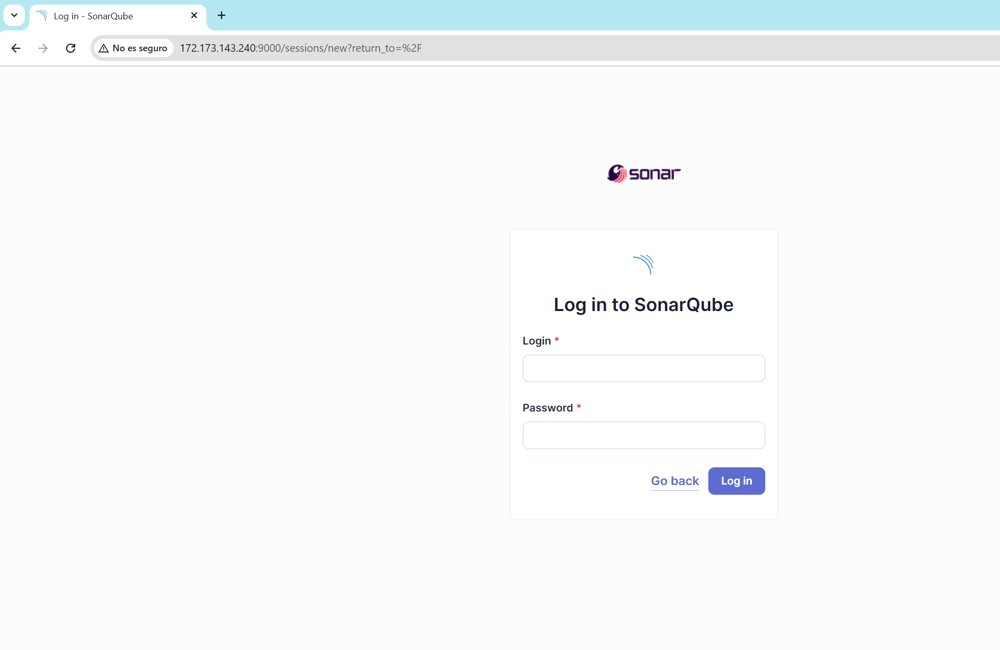
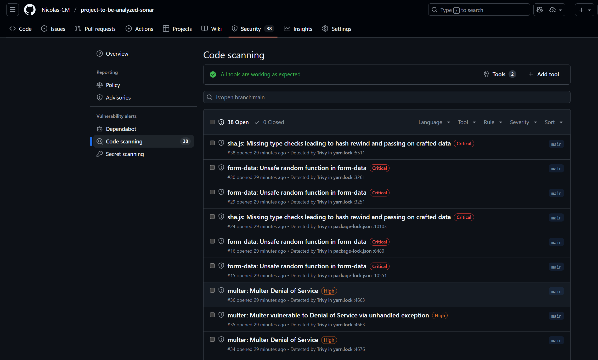
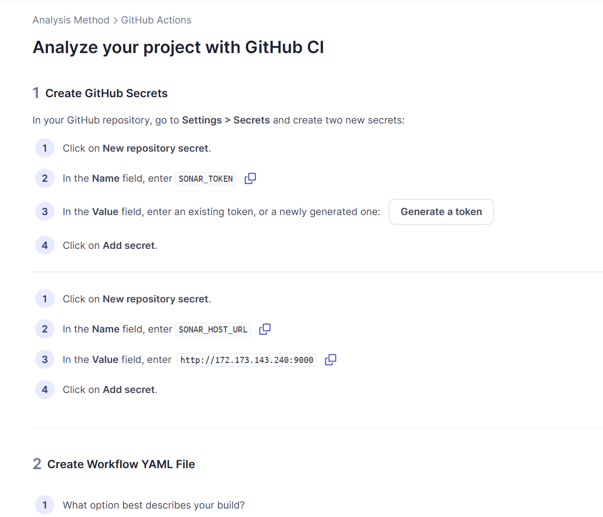
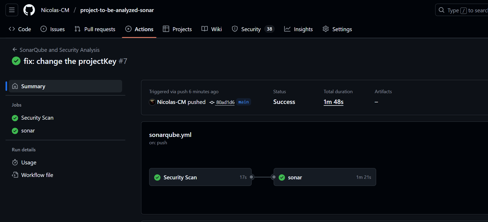
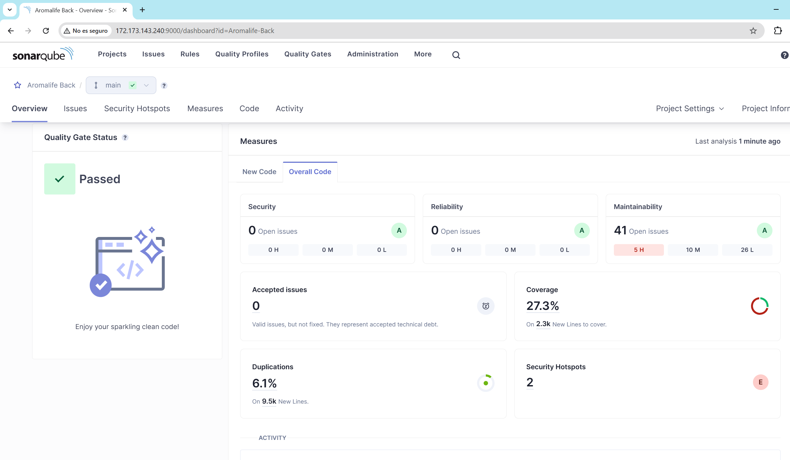

# Implementación de SonarQube en Azure para Análisis de Código

## Descripción General
Se implementó una solución completa de análisis estático de código utilizando SonarQube. El proceso se desarrolló en dos fases principales: una implementación local para validar la configuración, y posteriormente un despliegue en la nube de Azure utilizando Infrastructure as Code (IaC).

## Fase 1: Implementación Local con Docker

### Configuración Inicial
Se realizó una prueba de concepto utilizando Docker Compose para validar la configuración de SonarQube. Se definieron los siguientes servicios:

- **SonarQube**: Servidor principal para análisis de código
- **PostgreSQL**: Base de datos para almacenamiento persistente
- **Redes**: Configuración de red interna para comunicación entre servicios
- **Volúmenes**: Almacenamiento persistente para datos y configuraciones

La implementación local permitió verificar:
- Funcionamiento correcto de SonarQube
- Conexión adecuada con la base de datos
- Persistencia de configuraciones y datos
- Acceso a través del puerto 9000

## Fase 2: Implementación en Azure Cloud

### Infraestructura como Código
Se desarrolló un conjunto de archivos Terraform para automatizar el despliegue de la infraestructura en Azure. Los componentes principales incluyen:

- **Máquina Virtual**:
  - Sistema Operativo: Ubuntu 22.04 LTS
  - Tamaño: Standard_B2s (2 vCPUs, 4GB RAM)
  - Disco: 30GB SSD

- **Networking**:
  - Red Virtual dedicada
  - Subnet configurada
  - IP Pública estática
  - Grupo de Seguridad de Red (NSG)
    - Puerto 22 (SSH)
    - Puerto 9000 (SonarQube)

### Script de Aprovisionamiento
Se implementó un script de inicialización comprehensivo que:

1. Actualiza el sistema operativo
2. Instala Java 17 (requerido por SonarQube)
3. Descarga y configura SonarQube
4. Establece usuarios y permisos necesarios
5. Configura SonarQube como servicio systemd
6. Optimiza parámetros del sistema operativo
7. Inicia el servicio automáticamente

### Despliegue Exitoso
La infraestructura se desplegó correctamente en Azure:

El servicio SonarQube se instaló y configuró automáticamente, quedando accesible a través del puerto 9000

## Fase 3: Integración con el Proyecto

### Configuración del Proyecto en SonarQube
Se configuró un nuevo proyecto en el portal de SonarQube para analizar el repositorio [project-backend-aromalife-adn](https://github.com/Nicolas-CM/project-to-be-analyzed-sonar):

### Implementación del Pipeline
Se configuró un workflow de GitHub Actions para automatizar el análisis y la seguridad:

1. Se creó el archivo de workflow en el repositorio que incluye:
   - Análisis de código con SonarQube
   - Escaneo de vulnerabilidades con Trivy
2. Se configuraron los secretos necesarios en GitHub:
   - SONAR_TOKEN: Token de autenticación
   - SONAR_HOST_URL: URL del servidor SonarQube

El análisis de seguridad con Trivy proporciona información sobre vulnerabilidades:

### Resultados de la Integración
El pipeline se ejecuta automáticamente en cada push al repositorio:

Se realizan las siguientes acciones:
1. Checkout del código
2. Configuración del ambiente Node.js
3. Instalación de dependencias
4. Ejecución de tests con cobertura
5. Análisis de código con SonarQube
6. Publicación de resultados

Y nos muestra el análisis obtenido de parte de SonarQube en la máquina virtual desplegada:

## Enlaces de Referencia

### Repositorios
- [Infraestructura de SonarQube](https://github.com/Nicolas-CM/sonarQube-VM): Contiene la configuración de Terraform y scripts de aprovisionamiento
- [Proyecto Backend](https://github.com/Nicolas-CM/project-to-be-analyzed-sonar): Proyecto analizado con SonarQube

### Tecnologías Implementadas
- **Terraform**: Gestión de infraestructura como código
- **Azure**: Plataforma cloud para hosting
- **SonarQube**: Herramienta de análisis estático de código
- **GitHub Actions**: Automatización de CI/CD
- **Docker**: Contenedores para desarrollo local

---

## Autor: Nicolás Cuéllar Molina